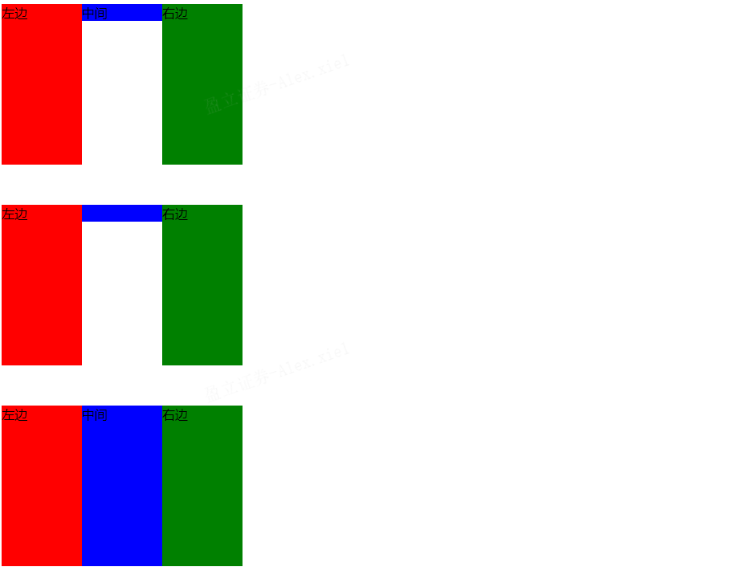

# CSS问题
## 选择器类型
|选择器|格式|优先级权重|
|---|---|---|
|id选择器|#id|100|
|类选择器|#classname|10|
|属性选择器|a[ref=“eee”]|10|
|伪类选择器|li:last-child|10|
|标签选择器|div|1|
|伪元素选择器|li:after|1|
|相邻兄弟选择器|h1+p|0|
|子选择器|ul>li|0|
|后代选择器|li a|0|
|通配符选择器|*|0|
## 隐藏元素的方法
- display: none：渲染树不会包含该渲染对象，因此该元素不会在页面中占据位置，也不会响应绑定的监听事件。
- visibility: hidden：元素在页面中仍占据空间，但是不会响应绑定的监听事件。
- opacity: 0：将元素的透明度设置为 0，以此来实现元素的隐藏。元素在页面中仍然占据空间，并且能够响应元素绑定的监听事件。
- position: absolute：通过使用绝对定位将元素移除可视区域内，以此来实现元素的隐藏。
- z-index: 负值：来使其他元素遮盖住该元素，以此来实现隐藏。
- transform: scale(0,0)：将元素缩放为 0，来实现元素的隐藏。这种方法下，元素仍在页面中占据位置，但是不会响应绑定的监听事件。
## CSS加载是否会阻塞DOM加载和渲染？
参考文章[CSS加载](https://www.cnblogs.com/qianxiaox/p/13761301.html)  
结论： 
1. css加载不会阻塞DOM树的解析
2. css加载会阻塞DOM树的渲染
3. css加载会阻塞后面js语句的执行  

解决思路：
1. 使用CDN(因为CDN会根据你的网络状况，替你挑选最近的一个具有缓存内容的节点为你提供资源，因此可以减少加载时间)
2. 对css进行压缩(可以用很多打包工具，比如webpack,gulp等，也可以通过开启gzip压缩)
3. 合理的使用缓存
4. 减少http请求数，将多个css文件合并，或者是干脆直接写成内联样式(内联样式的一个缺点就是不能缓存)

## 伪类和伪元素
1. 伪元素：在内容元素的前后插入额外的元素或样式，但是这些元素实际上并不在文档中生成。它们只在外部显示可见，但不会在文档的源代码中找到它们，因此，称为“伪”元素。
```CSS
p::before {content:"第一章：";}
p::after {content:"Hot!";}
p::first-line {background:red;}
p::first-letter {font-size:30px;}
```
2. 伪类：将特殊的效果添加到特定选择器上。它是已有元素上添加类别的，不会产生新的元素
```CSS
a:hover {color: #FF00FF}
p:first-child {color: red}
```
总结：伪类是通过在元素选择器上加⼊伪类改变元素状态，⽽伪元素通过对元素的操作进⾏对元素的改变。
## 清除浮动
浮动引起的问题：  
- 父元素的高度无法被撑开，影响与父元素同级的元素
- 与浮动元素同级的非浮动元素会跟随其后
- 若浮动的元素不是第一个元素，则该元素之前的元素也要浮动，否则会影响页面的显示结构

清除浮动方法：  
- 给父级div定义height属性
- 最后一个浮动元素之后添加一个空的div标签，并添加clear:both样式
- 包含浮动元素的父级标签添加overflow:hidden或者overflow:auto
- 使用 :after 伪元素。由于IE6-7不支持 :after，使用 zoom:1 触发 hasLayout**

## 解决移动端1px问题
1px 问题指的是：在一些 Retina屏幕 的机型上，移动端页面的 1px 会变得很粗，呈现出不止 1px 的效果。  
解决思路：
- 伪元素先放大后缩小：  
先放大、后缩小：在目标元素的后面追加一个 ::after 伪元素，让这个元素布局为 absolute 之后、整个伸展开铺在目标元素上，然后把它的宽和高都设置为目标元素的两倍，border值设为 1px。接着借助 CSS 动画特效中的放缩能力，把整个伪元素缩小为原来的 50%。此时，伪元素的宽高刚好可以和原有的目标元素对齐，而 border 也缩小为了 1px 的二分之一，间接地实现了 0.5px 的效果。  
```CSS
#container[data-device="2"] {
    position: relative;
}
#container[data-device="2"]::after{
      position:absolute;
      top: 0;
      left: 0;
      width: 200%;
      height: 200%;
      content:"";
      transform: scale(0.5);
      transform-origin: left top;
      box-sizing: border-box;
      border: 1px solid #333;
}
```
## 三栏布局
给定两边宽度,中间自适应
### 实现
1. float布局
```HTML
<div class="float">
        <div class="float-left">左边</div>
        <div class="float-right">右边</div>
        <div class="float-center">中间</div>
</div>
```
```CSS
.float {
    width: 300px;
    height: 200px;
}
.float-left {
    float: left;
    width: 100px;
    height: 200px;
    background: red;
}
.float-center {
    background: blue;
}
.float-right {
    float: right;
    width: 100px;
    height: 200px;
    background: green;
}
```

2. position: absolute布局
```HTML
 <div class="position">
        <div class="position-left">左边</div>
        <div class="position-right">右边</div>
        <div class="position-center">中间</div>
</div>
```
```CSS
.position{
    position: relative;
    width: 300px;
    height: 200px;
    padding-top: 50px;
}
.position-left {
    position: absolute;
    left: 0;
    width: 100px;
    height: 200px;
    background: red;
}
.position-center {
    background: blue;
}
.position-right {
    position: absolute;
    right: 0;
    width: 100px;
    height: 200px;
    background: green;
}
```

3. flex布局
```HTML
<div class="flex">
        <div class="flex-left">左边</div>
        <div class="flex-center">中间</div>
        <div class="flex-right">右边</div>
</div>
```
```CSS
.flex {
    display: flex;
    width: 300px;
    height: 200px;
    padding-top: 50px;
}
.flex-left {
    width: 100px;
    height: 200px;
    background: red;
}
.flex-center {
    flex: 1;
    background: blue;
}
.flex-right {
    width: 100px;
    height: 200px;
    background: green;
}
```

4. table布局
```HTML
<div class="table">
        <div class="table-left">左边</div>
        <div class="table-center">中间</div>
        <div class="table-right">右边</div>
</div>
```
```CSS
.table {
    display: table;
    width: 300px;
    height: 200px;
    padding-top: 50px;
}
.table-left {
    display: table-cell;
    width: 100px;
    height: 200px;
    background: red;
}
.table-center {
    display: table-cell;
    background: blue;
}
.table-right {
    display: table-cell;
    width: 100px;
    height: 200px;
    background: green;
}
```

5. grid布局
```HTML
<div class="grid">
        <div class="grid-left">左边</div>
        <div class="grid-center">中间</div>
        <div class="grid-right">右边</div>
</div>
```
```CSS
.grid {
    display: grid;
    grid-template-columns: 100px auto 100px;
    grid-template-rows: 200px;
    width: 300px;
    height: 200px;
    padding-top: 50px;
}
.grid-left {
    background: red;
}
.grid-center {
    background: blue;
}
.grid-right {
    background: green;
}
```

6. 效果图


## 垂直居中
### 实现
```HTML
<div class="container1">
        <div class="inner1">中间</div>
</div>
```
```CSS
.container1 {
    position: relative;
    width: 300px;
    height: 300px;
    background: red;
}

/* absolute + 负margin 需要知道子元素宽高 */
/* .inner1 {
    position: absolute;
    width: 100px;
    height: 100px;
    background: yellow;
    left: 50%;
    top: 50%;
    margin-left: -50px;
    margin-top: -50px;
} */

/* absolute + auto margin 需要知道子元素宽高 */
/* .inner1 {
    position: absolute;
    width: 100px;
    height: 100px;
    background: yellow;
    left: 0;
    top: 0;
    bottom: 0;
    right: 0;
    margin: auto;
} */

/* absolute + calc 需要知道子元素宽高 */
/* .inner1 {
    position: absolute;
    width: 100px;
    height: 100px;
    background: yellow;
    left: calc(50% - 50px);
    top: calc(50% - 50px);
} */

/* absolute + transform 不需要知道子元素宽高 */
/* .inner1 {
    position: absolute;
    background: yellow;
    left: 50%;
    top: 50%;
    transform: translate(-50%, -50%);
} */

/* 使用flex 或者grid实现 略 */
```